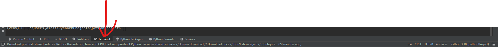

### Build instructions

1. Install Python 3.10 via _**[MICROSOFT STORE](https://www.microsoft.com/store/productId/9PJPW5LDXLZ5)**_
2. Install [Pycharm](https://www.jetbrains.com/pycharm/download/download-thanks.html?platform=windows&code=PCC)
3. Open pythonProject in **Pycharm**
4. Find '**Terminal**' tab in the bottom of Pycharm

5. Type `python -m pip install --upgrade pip setuptools virtualenv`
6. Type `py -m pip install -r requirements.txt`

Now you can just click the green play button   and run it